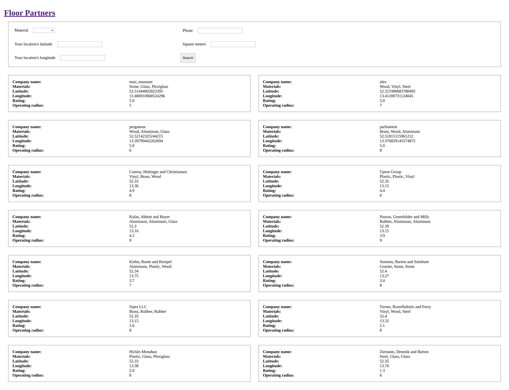
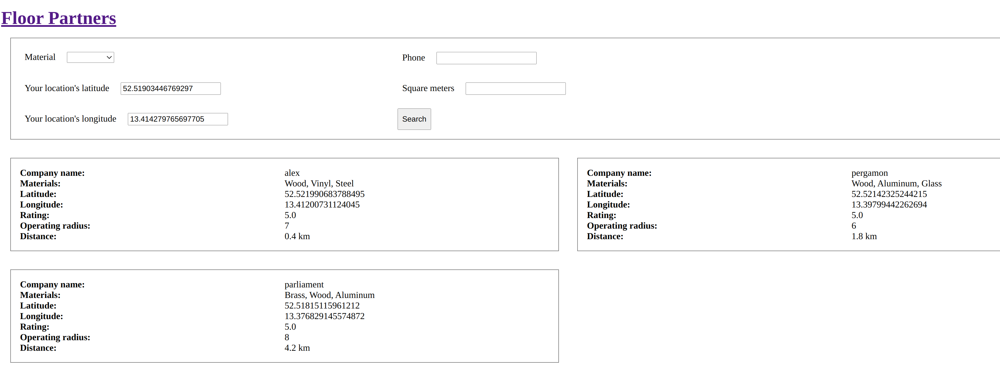
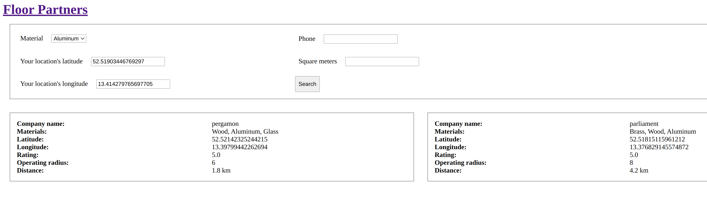

# README

This is an example app done as a coding challenge for showing flooring companies (partners) 
to interested customers depending on their project requirements (flooring material),
location and the partners operating radius covering the customers location.

## Interesting files

* [partner.rb](app/models/partner.rb)
* [partners_controller.rb](app/controllers/partners_controller.rb)
* [partners/index.slim](app/views/partners/index.html.slim)
* [partners.sass](app/assets/stylesheets/partners.sass)
* [seeds.rb](db/seeds.rb)
* [partner_helper.rb](test/helpers/partner_helper.rb)
* [partner_test.rb](test/models/partner_test.rb)
* [partner_search_test.rb](test/system/partner_search_test.rb)

## Setup

Asuming you have a postgres DB user `rails` with the password `rails` you can run `bin/rails db:setup`.
This will create the DB and add some test data so that you can see something similar like the following
when running the server locally.

## UI

### Display all partners

### Search by location

### Search by location and material

